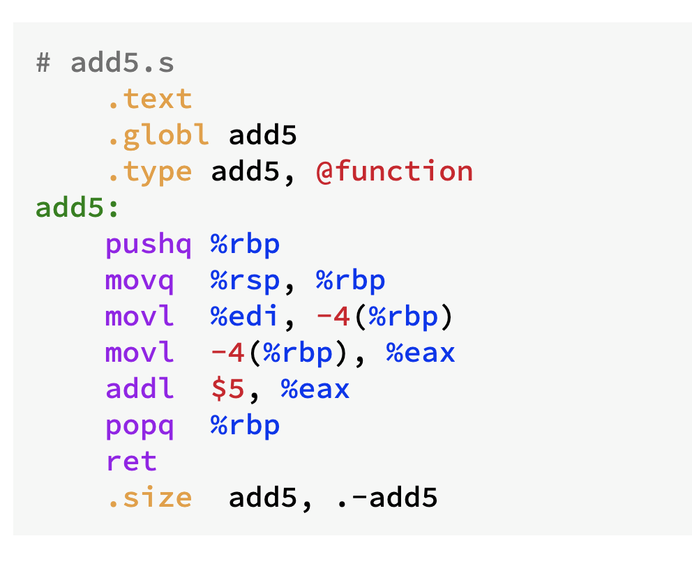

# x86 assembly (GNU assembler, AT&amp;T style) for [highlight.js](https://highlightjs.org/)



## Usage

Simply include the `highlight.js` library in your webpage or Node app, then load this module.

### Static website or simple usage

Simply load the module after loading `highlight.js`.  You'll use the minified version found in the `dist` directory.

```html
<script type="text/javascript" src="/path/to/highlight.min.js"></script>
<script type="text/javascript" src="/path/to/x86asmatt.min.js"></script>
<script type="text/javascript">
  hljs.highlightAll();
</script>
```

## License

`x86asmatt.js` is released under the MIT License.

### Author

Katsuhiko Gondow <gondow@cs.titech.ac.jp>

## Links

- The official site for the `highlight.js` library is <https://highlightjs.org/>.
- The `highlight.js` GitHub project: <https://github.com/highlightjs/highlight.js>


